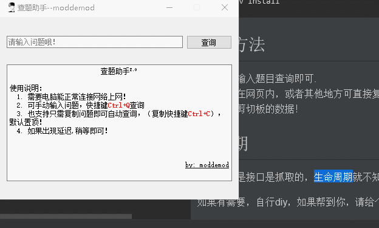

## 说明

使用PyQT5写的一个小程序，题库接口是抓取的！（也感谢一下题库的作者）
题库接口还是挺强大的，基本上大部分网课都可以查到！

开发环境是Python3.7

如果你需要本地运行，可运行下面的命令安装环境
```
$ git clone https://github.com/moddemod/course-query
$ cd course-query
$ pipenv install
```

## 使用方法

1. 手动输入题目查询即可.
2. 如果在网页内，或者其他地方可直接复制题目的，可直接复制题目后，会自动显示答案，会自动监测系统剪切板的数据！

## 有效期
由于题库是接口是抓取的，生命周期就不知道了，所以你看到的时候能用就能用！


效果如下：



如果有需要，自行diy，如果帮到你，请给个star！